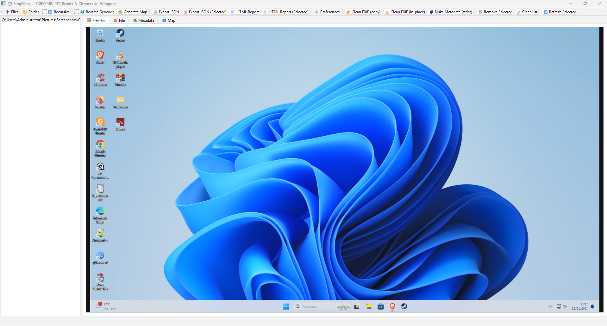

# 🐸 FrogGlass  
### The All-Seeing Frog of EXIF — Pure Python Metadata Inspector & Cleaner


---

## 🪶 Overview

**FrogGlass** is a modern open-source desktop application designed for those who care about **privacy, transparency, and control** over their images.  
It allows you to **inspect, visualize, and completely remove metadata (EXIF, XMP, IPTC, GPS, ICC, MakerNotes, and more)** — all through a friendly, frog-themed interface.  

No dependencies on `exiftool.exe`, no external binaries — **100% pure Python** powered by **PyQt6**.  
Just you, your images, and a wise frog with a magnifying glass. 🐸🔍

---

## 🖼️ Branding & Assets

| Type | File | Purpose |
|------|------|----------|
| 🧩 Icon | `assets/FrogGlass.ico` | Used in the executable (PyInstaller) |
| 🐸 Logo | `assets/logo.png` | Official FrogGlass logo |
| 📸 Screenshot | `assets/wk.png` | Example of the application in action |

---

### 💚 FrogGlass Logo
<p align="center">
  
</p>


### 🪟 Screenshot
<p align="center">
  
</p>


---

## ✨ Features

- 📷 Reads **all metadata**: EXIF, XMP, IPTC, ICC, MakerNotes, GPS, comments, thumbnails, etc.
- 🗺️ **GPS Map View** — see where your photo was taken, directly on an interactive map.
- 🧭 **Reverse Geocoding** — automatically resolve coordinates into a real-world location.
- 💣 **Strict Metadata Wipe (NUKE Mode)** — total cleanup, zero traces left.
- 🧹 **Clean Mode** — removes common EXIF safely while preserving the image.
- 🧩 **Batch Operations** — select multiple images, clean or export them at once.
- 🪟 **Drag & Drop Support** — drop images or folders directly into the window.
- 🔄 **Auto-Refresh** and **Persistent List State** between sessions.
- ⚙️ **Preferences Panel** — customize your defaults:
  - “Clean in-place” or copy mode  
  - Verify after NUKE  
  - Open reports automatically after save
- 📦 **Export Metadata** to JSON or HTML reports.
- 📊 **Progress Bar** for all heavy operations.
- 🌗 Automatic **dark/light theme** integration with your OS.
- 🧠 Fully **cross-platform** — works on Windows, macOS, and Linux.

---

## 🧰 Tech Stack

| Component | Technology |
|------------|-------------|
| Language | Python 3.12+ |
| GUI | PyQt6 |
| Image Handling | Pillow, piexif |
| Metadata Parsing | lxml, xmltodict |
| Mapping | folium, geopy |
| Build System | PyInstaller |

---

## 💾 Installation

Clone and install dependencies:

```bash
git clone https://github.com/<your-user>/FrogGlass.git
cd FrogGlass
pip install -r requirements.txt
python FrogGlass.py
````

### 🔧 Requirements File

```txt
PyQt6>=6.6.0
Pillow>=10.2.0
piexif>=1.1.3
folium>=0.16.0
lxml>=5.2.1
xmltodict>=0.13.0
geopy>=2.4.1
```

---

## 🧩 Building a Standalone Executable

You can easily compile FrogGlass into a single `.exe` file for Windows.
All assets (`logo.png`, `wk.png`, `FrogGlass.ico`) are stored inside the `assets` directory.

### 🐸 Simple Build Command

```powershell
pyinstaller --noconfirm --windowed --onefile --icon=assets/FrogGlass.ico FrogGlass.py
```

This produces:

```
dist\FrogGlass.exe
```

The result is a single executable file that can run on any system with no dependencies.
You can compress it as a `.zip` for sharing or publication.

---

## 🧭 Usage Guide

### 🔍 Inspecting Metadata

1. Launch **FrogGlass**.
2. Drag one or multiple image files into the main window.
3. Click an image to view all EXIF data.
4. If the image contains GPS info, press **Map** to open an interactive view.

### 🧹 Cleaning / Nuking

* **Clean EXIF** → Safe removal (preserves thumbnails, color profiles).
* **Nuke Metadata (strict)** → Absolute wipe — leaves nothing but the raw image.

### 📄 Exporting

* **Export JSON** → Full metadata in structured format.
* **HTML Report** → Beautifully formatted metadata viewer.
* You can also export for multiple selected files.

### ⚙️ Preferences

FrogGlass saves your preferences to:

```
~/.frogglass_state.json
```

These include:

* Default cleaning behavior
* Verification rules
* Report auto-open setting

---

## 🎨 Design Philosophy

FrogGlass was built to be **educational**, **beautiful**, and **safe**:

* No files ever leave your computer.
* No remote connections or telemetry.
* Every operation is transparent and reversible.
* The frog is curious, not creepy. 🐸🔍

It’s a digital magnifying glass that respects your privacy while revealing the truth hidden inside your photos.

---

## 🧙‍♂️ Author

**Víctor Duarte Melo**
Independent Researcher — Cryptography, Mathematics & Software Engineering
Creator of: **ECCFrog**, **KyFrog**, **FrogPack**, and now **FrogGlass**

📫 [GitHub](https://github.com/victormeloasm) • [LinkedIn](https://www.linkedin.com/in/victormeloasm)

---

## 📜 License

Licensed under the **MIT License**.
Free for personal, academic, and commercial use.

```
Copyright (c) 2025 Víctor Duarte Melo
Permission is hereby granted, free of charge, to any person obtaining a copy of this software...
```

---

## 🌈 Acknowledgments

* 🐍 The **Python** open-source community.
* ☕ Countless late-night coffees.
* 🐸 And the spirit of the **Frog Mage**, forever peering through the glass of truth.

> “The eyes of the frog see what others ignore.” – Anonymous Amphibian


## ⭐ Support the Project

If you like **FrogGlass**, consider giving it a ⭐ on GitHub — it really helps visibility!
Spread the word, protect your privacy, and keep your EXIFs clean. 💚🐸
